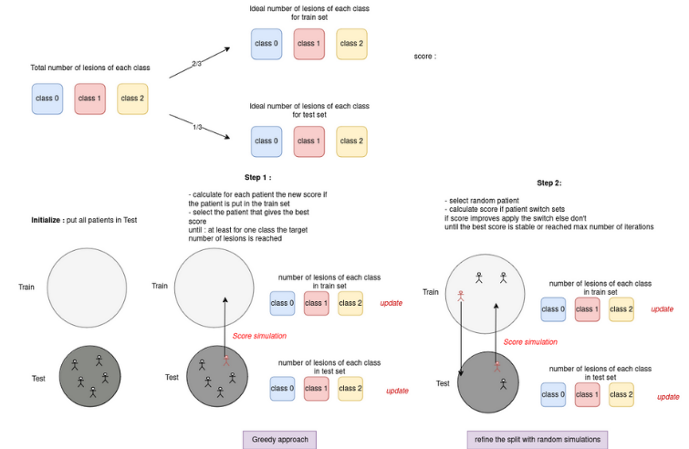

# Split patient data for machine learning models

### First step :

Add the pipeline path to sys.path so that your python compilator find all the modules of the pipeline : go to module handle_paths execute comand in terminal 

```
python add_pipeline_path.py /home/user/my_project/pipeline
```

### Usage

execute main.py 

inputs : 

- path to your data in csv format, must contain column 'patient_id' and 'label'
- method : 'pl','genetic','greedy'

default for genetic :

- population_size = 100,
- nb_generations = 500,
- elite_size_ratio = 0.3

output : X_train, y_train,X_test,y_test as panda dataframes


### Problematic

To train and validate machine learning models, we needed to split patient data into training and testing sets while avoiding patient bias. Patient bias occurs when data from the same patient is divided between training and testing sets, potentially skewing results. This bias arises because the model might learn patient-specific characteristics rather than generalizable features, leading to overestimation of the model’s performance. Ensuring that no patient’s lesions are split across the sets and maintaining balanced class ratios is a non-trivial problem.

### General settings

One-third of the data is allocated to the test set and two-thirds to the training set.


### Case study 

The algorithms were originally developped on a dataset containing patients with several tumours, each lesion had a class label :

• 0: ’Responsive’,
• 1: ’Progressive’,
• 2: ’Stable’

however the algorithms are generalizable to other scenarios, we assume that your data has a column 'patient_id' and a column 'label' and take into account a maximum of three classes.

## Genetic algorithm

Genetic algorithms (GAs) are a class of stochastic optimization techniques inspired by the principles of natural selection and genetics, commonly employed for solving complex optimization and search problems in bioinformatics and computational biology. GAs are particularly effective in handling large, multidimensional
search spaces where traditional optimization methods may falter.

<p align="center"></p>

<p> Individual modeling

We will model a split as an individual or a chromosome, it is a candidate solution. Concretely, a split is an
array of size N, the number of patients, which contains 0 if the patient is in the train set and 1 if the patient
is in the test set. We initialize a population with random splits respecting a ratio of 2/3 of 0 and 1/3 of 1.

<p> Fitness Calculation

The fitness of an individual is calculated based on the deviation of the lesion counts in the training and test
sets from the target counts. The fitness function is defined as:

<p align="center"></p>


<p> Generation Simulation

Each generation involves evaluating fitness, applying elitism, and mutating individuals. The process for creating a new generation is as follows:

<p align="center"></p>

<p> Mutations

Mutation is a crucial operator in genetic algorithms that introduces diversity into the population by randomly altering the genetic material (in this case, the set partition of patients). It helps prevent premature convergence to suboptimal solutions and allows exploration of new regions in the solution space.
We introduce a random change at each mutation : we swap two patients, one goes into the training set and one goes into the test set (we decide randomly which patient to switch and we decide randomly in which set we randomly pick the patient). This localized change ensures that the structure of the individual is not
drastically altered, which is crucial for maintaining a gradual search process.

<p> Selection mechanism and Replacement Strategy

We determine the next generation by selecting a proportion of the fittest individuals (hyperparameter) and the rest undergoes mutations according to a mutation rate µ (hyperparameter). Mutations ensure population diversity to prevent premature convergence to local optima and to explore the solution space
effectively. We don’t use recombinaison as in our case recombinaison is pretty much the same as provoking a lot of mutations to one individual which allows to explore the solution space but in order to avoid convergence to local optimum we preferred to implement an initially high mutation rate with a decay over generations than to compute such jumps in the solution space over generations and risk disrupting good solutions. The gradual process as the mutation rate decays helps in fine-tuning a good solution after we first explored large
jumps to escape local minima.

<p> Hyperparameters

• Mutation rate µ
• Proportion of the elite individuals conserved
• Weights for number of lesions
• Weights for classes
• Population size
• Number of generations


This genetic algorithm is designed to split a set of patients into training and test sets while minimizing
the deviation from target lesion distributions for each set. The algorithm begins by initializing a population
of individuals, each representing a potential split. The fitness of each individual is evaluated based on the
difference between the actual and target lesion counts in the training and test sets. The algorithm iterates
through generations, applying elitism to retain the best individuals and mutation to introduce variability.
The process continues until the stopping criteria are met, such as a fixed number of generations or convergence
in fitness values. The result is a split of patients that closely matches the desired lesion distribution targets.


## Greedy algorithm


The greedy algorithm is designed to partition patients into training and test sets such that the distribution of lesions across classes in each set closely matches predefined targets. The process is outlined as follows:

<p align="center"></p>


<p> Initialization

Initially, the algorithm determines the total number of lesions for each class across all patients. Next, we calculate the target number of lesions for both the training and test sets based on a specified training ratio (e.g., 2/3 ). This ratio is used to allocate a proportion of the total lesions to the training set, with the remainder assigned to the test set.

<p> Greedy Patient Selection

In the first phase, the algorithm uses a greedy approach to build the training set. It iteratively selects the best patient to add to the training set based on how well it aligns the current lesion distribution with the target counts. Specifically, for each patient in the test set, the algorithm simulates adding that patient to the training set and calculates the resulting score, which reflects the deviation from the target lesion counts. The patient that results in the lowest score is added to the training set. This process continues until the training set meets or exceeds the target lesion counts for all classes. The result of this phase is an initial split of patients into training and test sets.

<p> Refinement of the Split

In the second phase, the algorithm refines the initial split by performing local adjustments. It randomly selects patients from the training and test sets and attempts to swap them. Each swap is evaluated based on its impact on the lesion distribution, and if the new split results in a lower score (i.e., closer to the target counts), the swap is accepted. This refinement phase continues for a maximum number of iterations or until convergence is achieved. Convergence is defined as a situation where there is no improvement in the score over a series of iterations.

<p> Output

The algorithm returns the best split of patients into training and test sets, the corresponding best score, and a record of scores achieved throughout the refinement process. The final split aims to balance the lesion counts in both sets as closely as possible to the predefined targets. Overall, the greedy split algorithm combines an initial greedy selection approach with iterative refinement to achieve an optimal distribution of patients, minimizing discrepancies in lesion counts between the training and test sets.

## Linear Program

Linear programming (LP) is a mathematical optimization technique used to achieve the best outcome in a mathematical model whose requirements are represented by linear relationships.

<p> Variables


<p align="center"></p>


<p> Objective function


<p align="center"></p>


<p> Constraints


<p align="center"></p>


Solver Configuration:

• Heuristics enabled
• Preprocessing enabled
• Allowable gap for approximation: 0.1
• Maximum number of nodes: max iterations
• Time limit: 600 seconds

The goal of this optimization problem is to split a set of patients into training and test sets while minimizing the deviation from target lesion data distributions for each set. The objective function aims to minimize a weighted sum of the deviations for both training and test sets, with weights α and β respectively. The constraints ensure that the lesion data distributions for each label in the training and test sets are within the specified targets. Additional constraints link the binary variables to ensure that each patient is assigned to either the training or test set, and maintain non-negativity.


